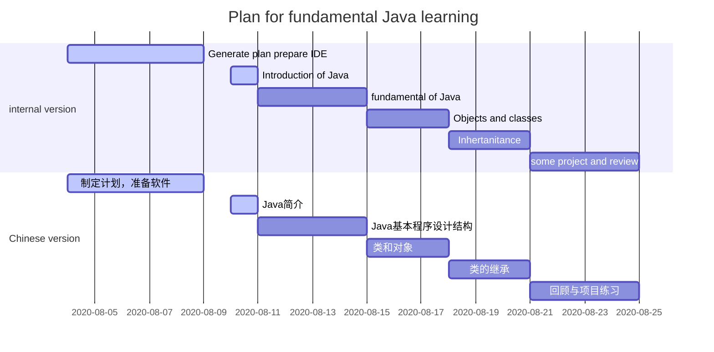

# Pathway of prepare 4th-year project

## Before start

I have seen the video sent to me. I have admit that is awesome and I am very interested it. I plan my pathway for the prepare for this project and there are mainly three states(Java learning, Android learning and Android project learning)  and last 30 days around.

## State 1: Java learning

It may takes me some time to get familiar with Java. I used C, Python and MATLAB in the past projects but not Java. I plan to use 2 weeks to go through some basic tutorials. I choose to use hybrid methods to do that. I will take video course on website and with the guide of books

Book: [Core Java 2 Volume I - Fundamentals](http://93.174.95.29/main/EC420D50D3311E3CCDF4D931858C0521)

I do not think I have go through all the content of the book. I just pick some basic parts.

[vedio1](https://www.bilibili.com/video/BV1gb411F76B?from=search&seid=5863039336557603002): length : 44h

### structure

**Note:** The content for project and review is not confirmed.

## State 2&3: Android learning

I just search some tutorials might help. The specific plan is not confirmed.

- [Android Training](https://link.zhihu.com/?target=http%3A//hukai.me/android-training-course-in-chinese/index.html)

- [Android API Guides](https://link.zhihu.com/?target=https%3A//developer.android.com/guide/index.html)

- [book](http://93.174.95.29/main/1863DA93C4AA758F57A9C6C6E60E772E)

  